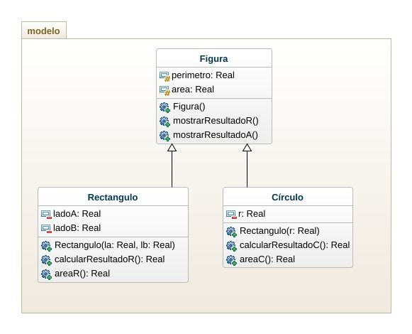

# Herencia1

### Diseñar e implementear un programa en java que permita realizar las 4 operaciones básicas, suma, resta, multiplicación y división.

# Herencia2
### Implementar un programa en java para calcular el área y el perimetro de un rectángulo y un círculo.

